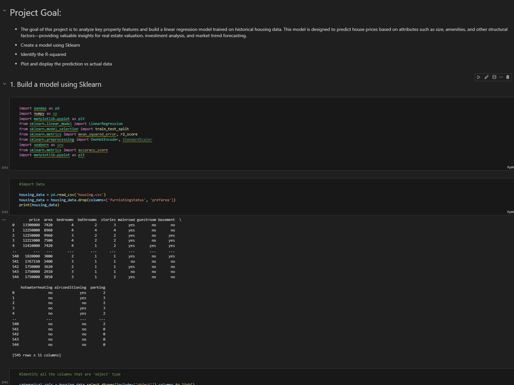

# Title: Home Value Insight – Predicting House Prices Using Scikit-learn Regression

# Program by: John Rivero

# Date: April 18, 2025

# Description

-   Home Value Insight is a machine learning project focused on predicting housing prices using multiple linear regression. By leveraging key property features such as area, number of bedrooms and bathrooms, presence of amenities, and location-based variables, this model provides a data-driven estimate of a house’s value. This project demonstrates the full machine learning pipeline—from data cleaning and feature engineering to model training, evaluation, and visualization. It’s ideal for those looking to explore real estate analytics, regression modeling, or get hands-on experience with supervised learning using Scikit-learn.

## Code

-   Below is an image of the code.

## Result

-   Below is an image of the result.

